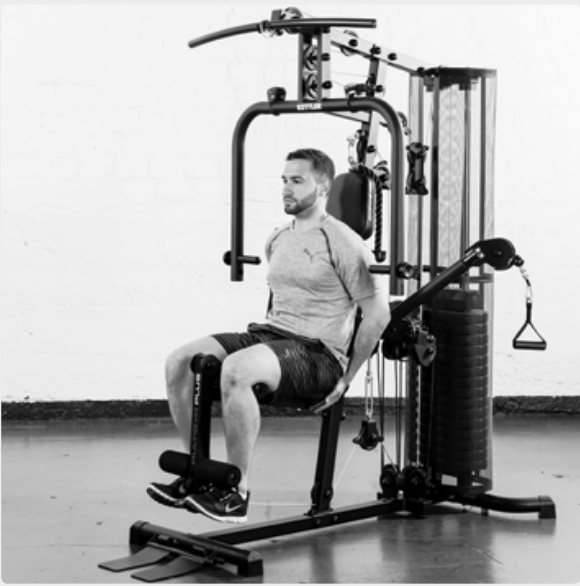

# 1. Leg Extension

__Starting position__: upright posture with back against back rest. The lower curl roller is just above the ankle joint. Raise tip of foot. Axis of knee joint at level of
apparatus axis.

__Movement__: Stretch leg then lower it slowly again.

__Muscles used__: Leg-stretching muscles

