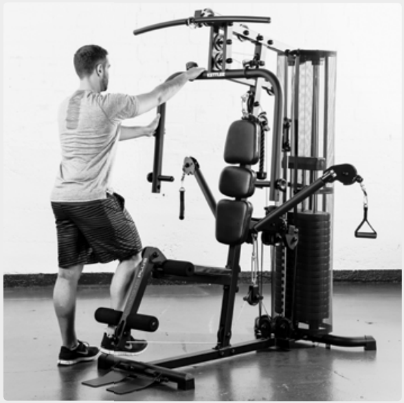
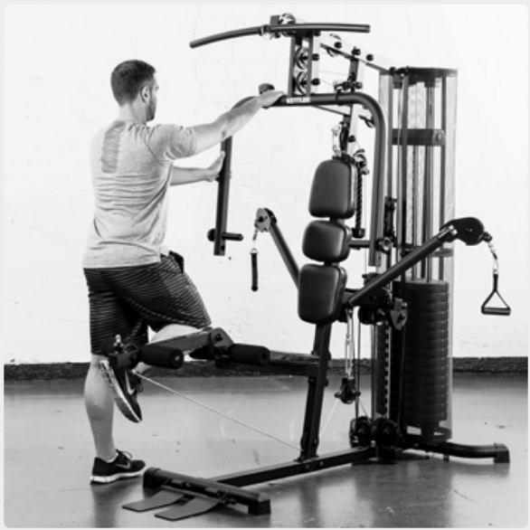
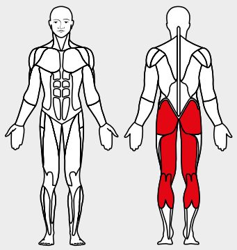

# 2. Leg Curl

__Starting position__: Stand facing the apparatus. The lower curl roller is at the level of the Achilles tendon. The upper curl roller is just above the knee cap. The tips of
the feet are raised.

__Movement__: Pull the ankle up towards the seat.

__Muscles used__: Leg-bending muscles, seat muscles

