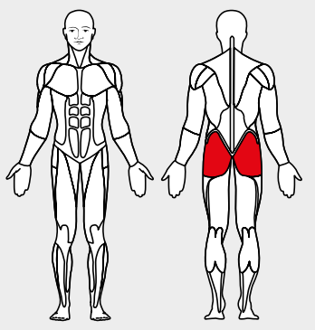

# 3. Cable Hip Extension

__Starting position__: Fold the seat in. Hook the foot loop onto the lower rope pulley. Stand facing the apparatus with the torso leaning slightly forward. The foot loop
is above the ankle joint.

__Movement__: Move the stretched leg backwards. Avoid forming a hollow back (keep
the belly muscles tense).

__Muscles used__: Seat muscles

