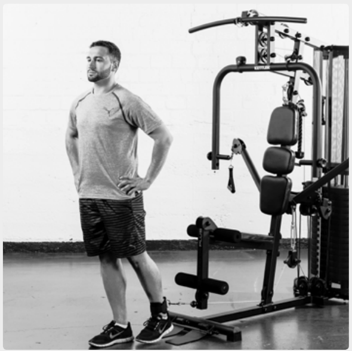
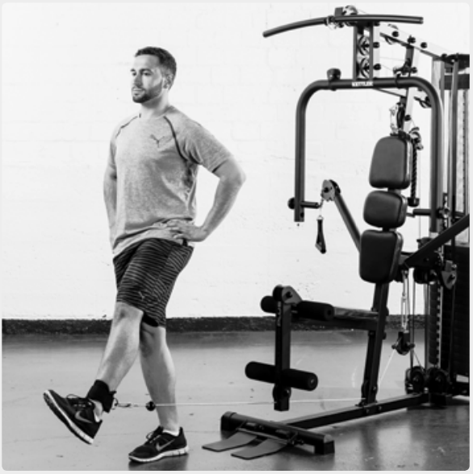
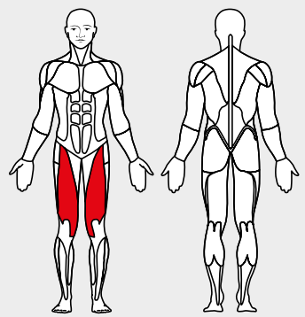

# 4. Cable Hip Flexion

__Starting position__: Hook the foot loop onto the lower rope pulley. Stand with the back to the apparatus. The foot loop is above the ankle joint.

__Movement__: Lift the stretched leg up from the hip. Then lower the weight slowly again. 

__Muscles used__: Hip-bending muscles, thigh-stretching muscles

__Variant__: In lying position
