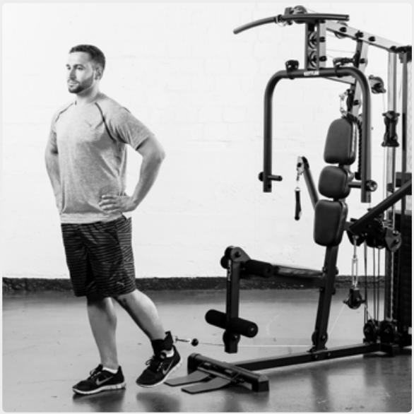
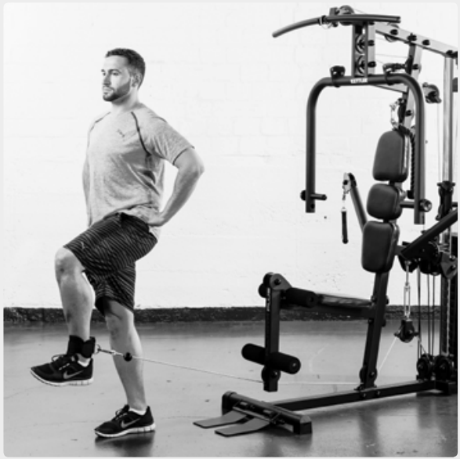
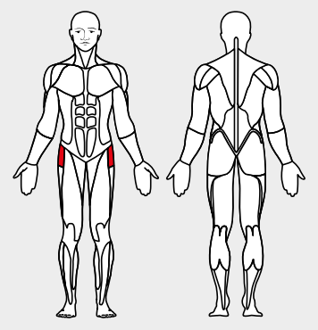

# 5. Cable Leg Raise

__Starting position__: Fold the seat in. Hook the foot loop onto the lower rope pulley. Stand with your back to the machine. Position the the loop just above the ankle.

__Movement__: Lift the knee and lower it again slowly. Keep the body erect.

_Muscles used_: Thigh-bending muscles

__Variant__: In lying position
