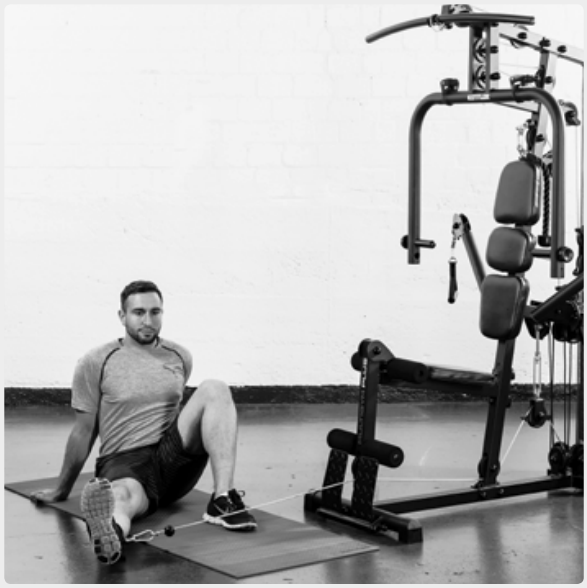
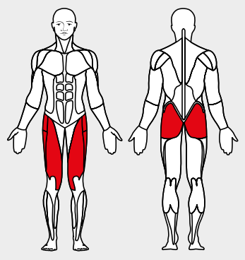

# 6. Abductor flexion, seated

__Starting position__: Fold the seat in. Hook the foot loop onto the lower rope pulley. Sit on floor with apparatus at the side. Attach the loop to the leg furthest away from
the apparatus. Raise the knee of the other leg off the floor.

__Movement__: Move the leg with the loop away from the apparatus against its resistance.

__Muscles used__: Abductor, hip-bending and leg-stretching muscles
