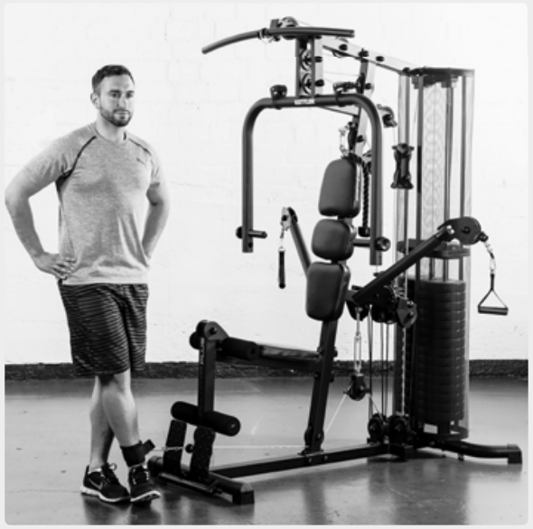
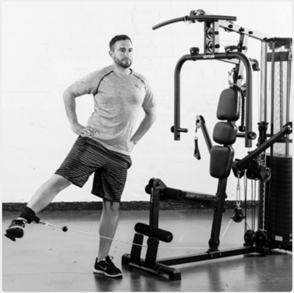
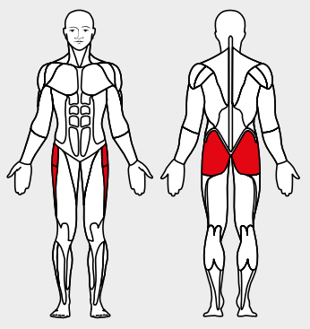

# 7. Abductor flexion, standing

__Starting position__: Fold the seat in. Hook the foot loop onto the lower rope pulley. Stand with the apparatus at your side. Attach the loop to the leg furthest away
from the apparatus.

__Movement__: Move the leg with the loop away from the apparatus against its resistance.

__Muscles used__: Abductor, seat muscles

