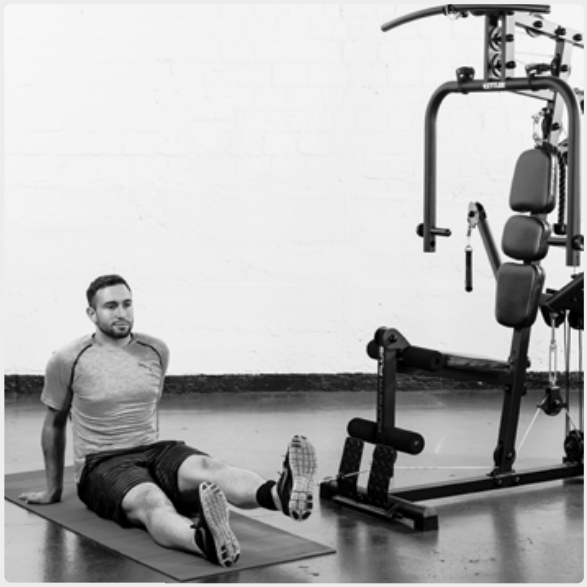
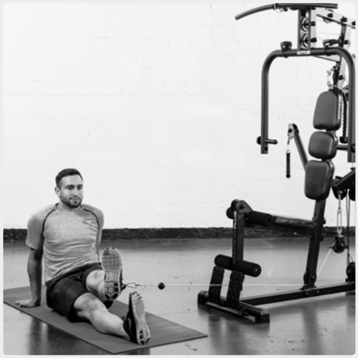
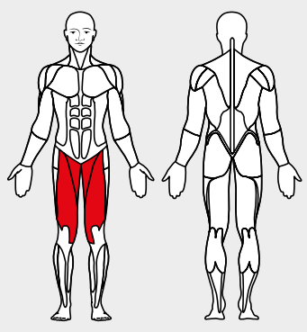

# 8. Adductor flexion, seated

__Starting position__: Fold the seat in. Hook the foot loop onto the lower rope pulley. Sit on floor with apparatus at the side with the legs apart. Attach the loop to the
leg nearest to the apparatus.

__Movement__: Move the leg with the loop away from the apparatus against its resistance.

__Muscles used__: Adductor, hip-bending and leg-stretching muscles
