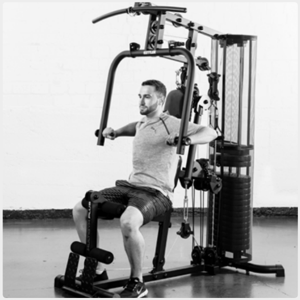
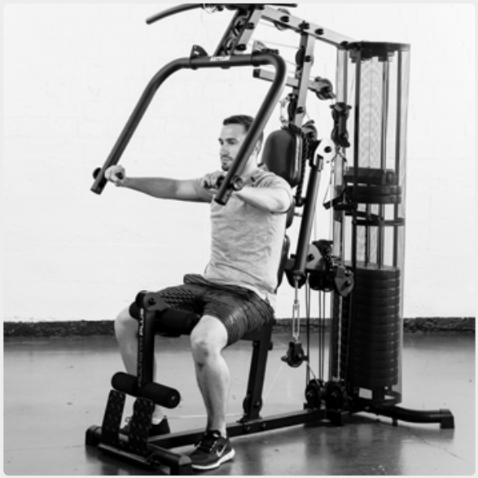
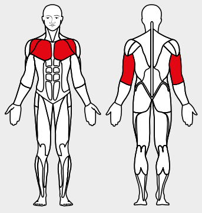

# 10. Bench Press

__Starting position__: Adjust the height of the seat so that the push bar is at chest height. Keeping the back straight, lean the back against the back rest.

__Movement__: Push the bar forward. Do not fully straighten the elbows. Then allow the bar to descend to chest level.

Muscles used: Chest muscles, triceps, front shoulder muscles

