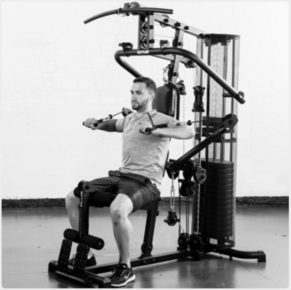
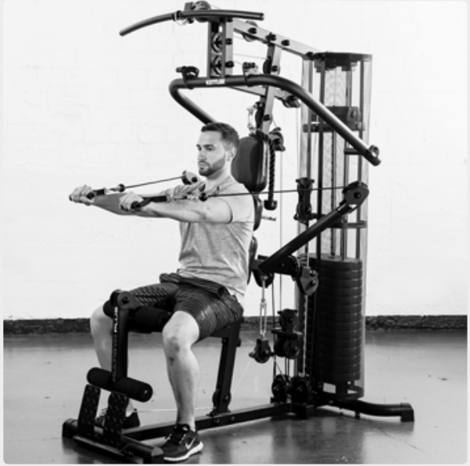
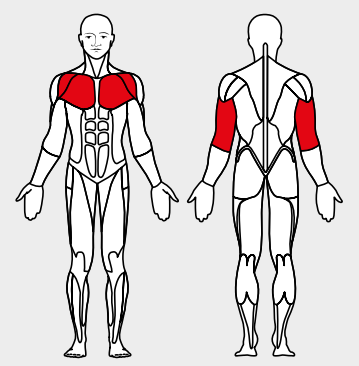

# 11. Cable Chest Press

__Starting position__: Set 3D-FLEXMOTION arms at chest level. Keeping the back straight, lean the back against the back rest.

__Movement__: Push the loops forward past the body. Then bend the elbows and lower the weight slowly.

__Muscles used__: Chest muscles, triceps, front shoulder muscles

