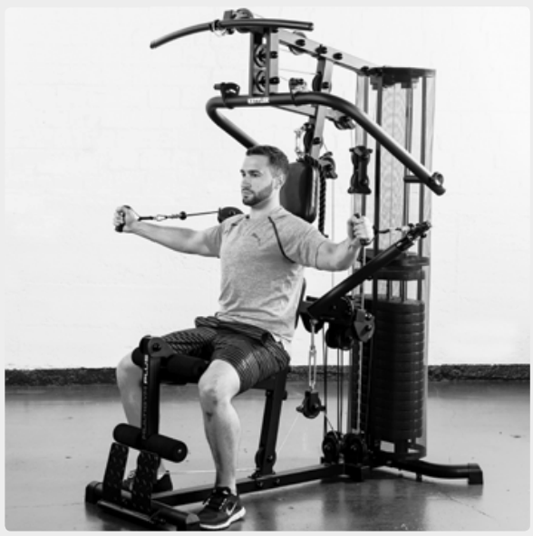
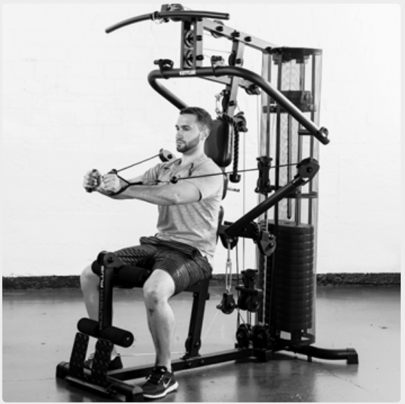
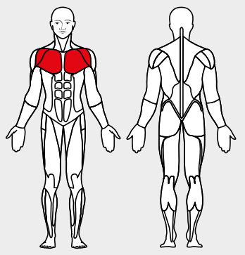

# 12. Flies

__Starting position__: Set the 3D-FLEXMOTION arms at exercising height. Keeping the back straight, lean the back against the back rest.

__Movement__: With the arms fully extended, pull the loops together in front of the body.

__Muscles used__: Chest muscles, front shoulder muscles

__Variant__: Lower, middle, higher
