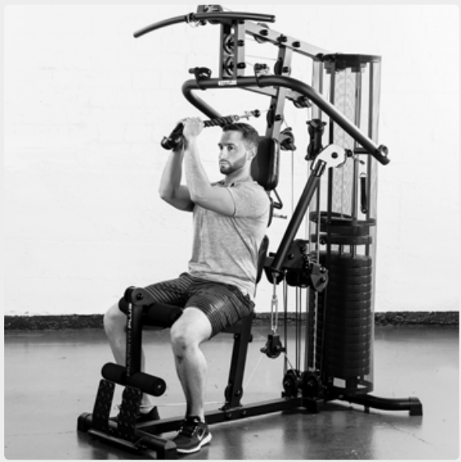
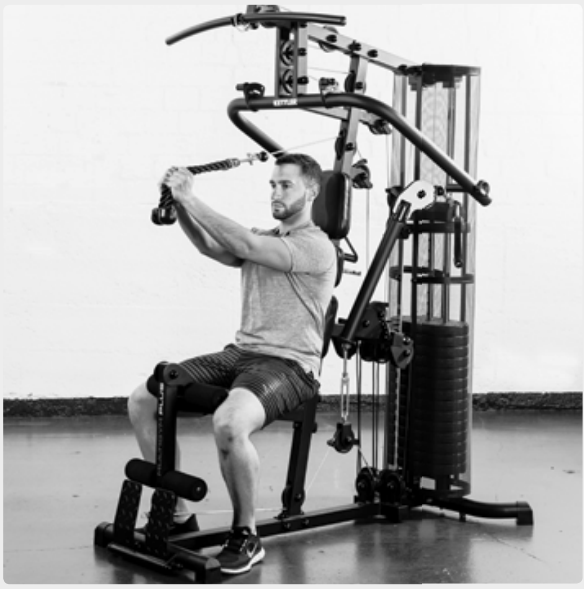
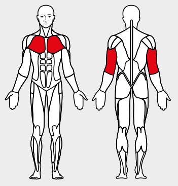

# 13. Pull Over

__Starting position__: Set the 3D-FLEXMOTION arms upright. Keeping the back straight, lean the back against the back rest. Bend the arm at the elbow so that the angle of the arm to the body is approx. 90°.

__Movement__: Stretch the arms, closing the body-arm angle at the same time. 

Muscles used: Triceps, chest muscles, saw-tooth muscle

Variant: With bar, with loops, in standing, sitting or lying position
