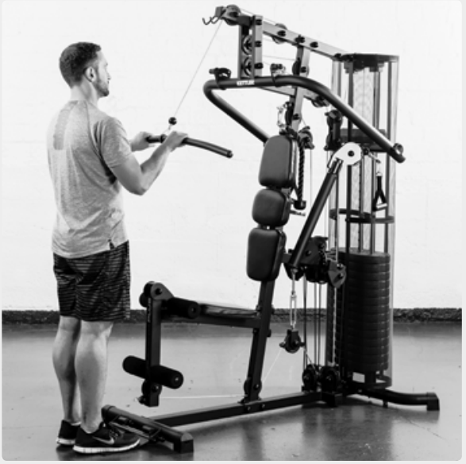
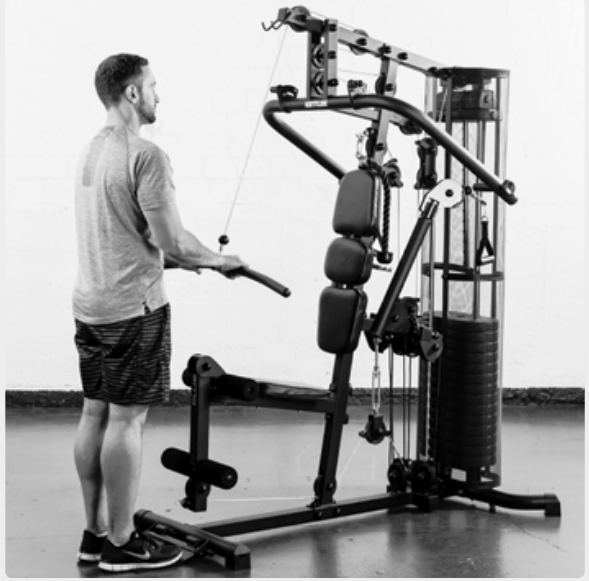
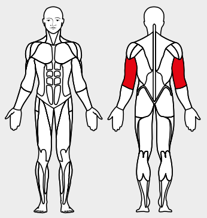

# 14. Cable Push down

__Starting position__: Stand facing the machine. Attach the bar or the loops to the top rope pulley. The elbow angle is 90°.

__Movement__: Stretch the arms and then move them back to the right-angle position.

__Muscles used__: Triceps

__Variant__: With bar or with loops
