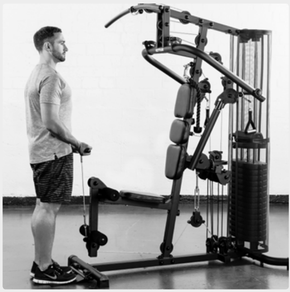
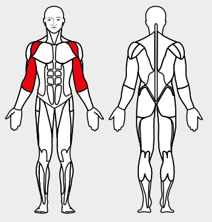

# 15. Biceps curls

__Starting position__: Fold the seat in. Stand facing the machine. Attach the bar to the lower rope pulley.

__Movement__: The upper arm is fixed in front of the body. Bend the elbow joint to 90°.

__Muscles used__: Short biceps head, front shoulder muscles.

__Variant__: With bar or with loops
