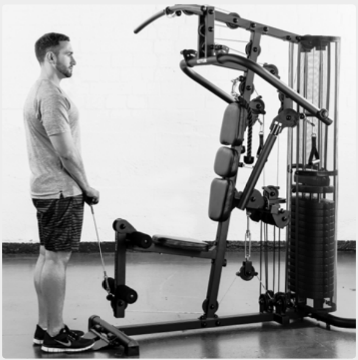
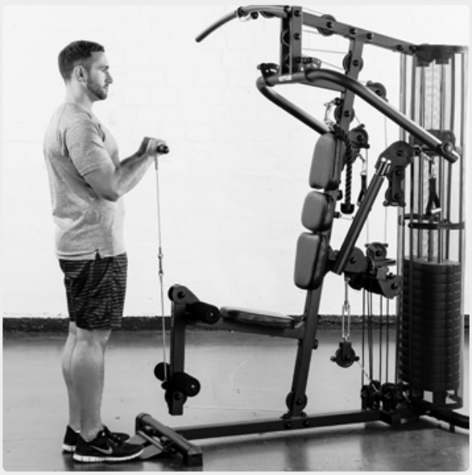
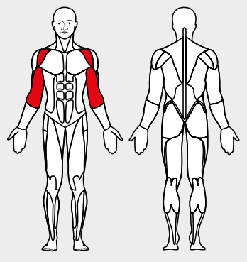

# 16. Hammer biceps curls

__Starting position__: Fold the seat in. Stand facing the machine. Attach the bar or the loops to the lower rope pulley.

__Movement__: The upper arm is stationary in front of the body. Bend 90° at the elbow.

__Muscles used__: Long biceps head, front shoulder muscles

__Variant__: With bar or with loops
