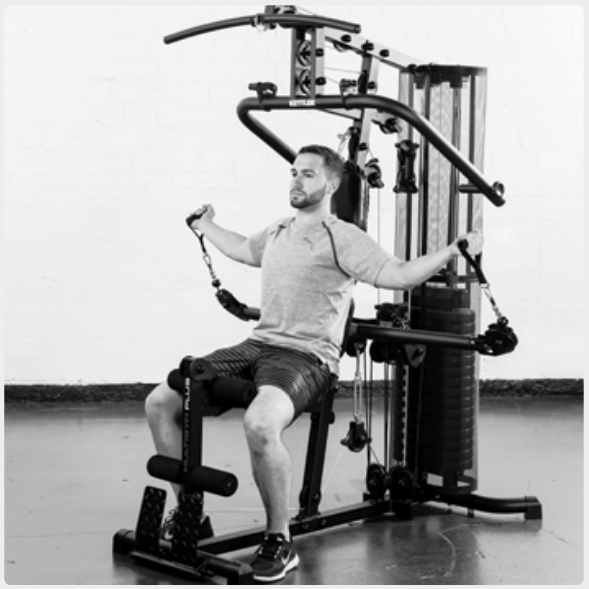

# 17. Overhead biceps curls

__Starting position__: Set the 3D-FLEXMOTION arms upright. Keeping the back straight, lean the back against the back rest. The elbows are at head level. The shoulder blades are pressed together.

__Movement__: The upper arm is fixed in position. By bending at the elbow, move the hands behind the head.

__Muscles used__: Biceps, shoulder muscles, rhomboid muscle

