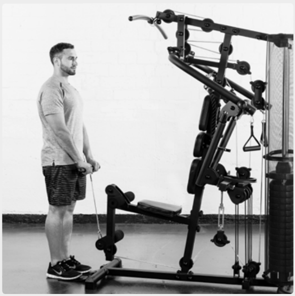
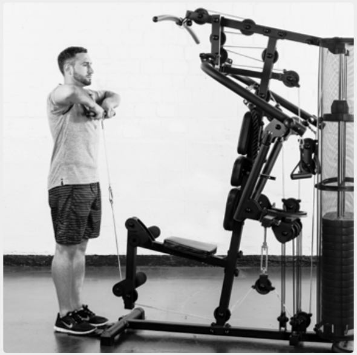
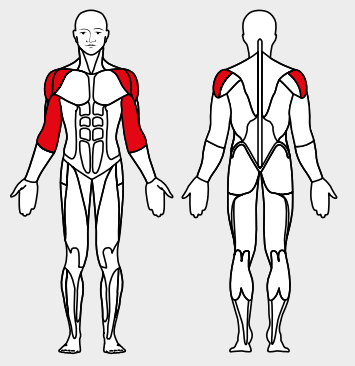

# 18. Upright Row

__Starting position__: Fold the seat in. Stand facing the machine. Attach the bar or the loops to the lower rope pulley. The hands grasp the bar from above.

__Movement__: Pull the bar or the loops along the body and up to chin height. The elbows point upwards. Muscles used: Shoulder muscles, biceps

__Variation__: Close or wide movment, with bar or loops

