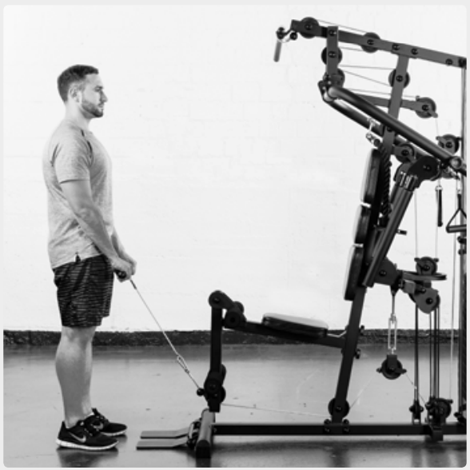
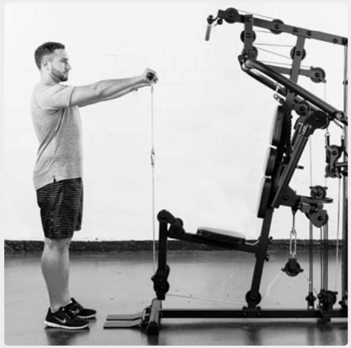
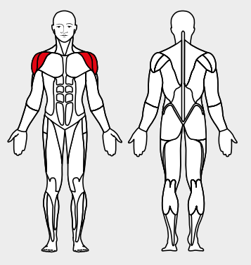

# 19. Front Raise

__Starting position__: Fold the seat in. Stand facing the machine. Attach the bar or the loops to the lower rope pulley. The hands grasp the bar from above.

__Movement__: Pull the bar or the loops along the body and up to chin height. Keep the arms extended.

__Muscles used__: Front and middle shoulder muscles

__Variant__: With bar or with loops
