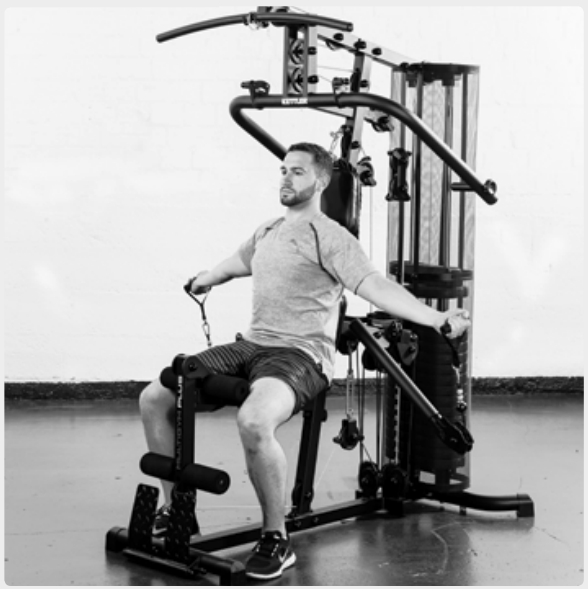
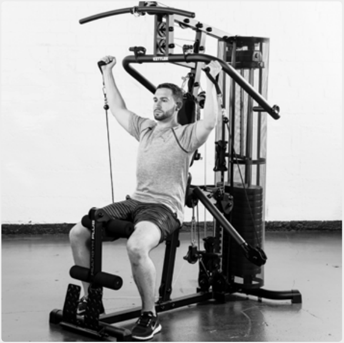
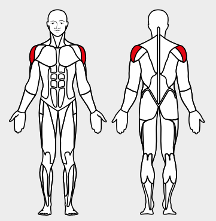

# 20. Lateral Raise

__Starting position__: Set the 3D-FLEXMOTION arms to point downwards. The hands grasp the loops from above.

__Movement__: Keeping the arms extended, move them upwards past the body.

__Muscles used__: Shoulder muscles

__Variant__: Standing or seated or with the body bent forward
