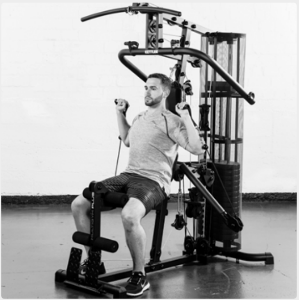
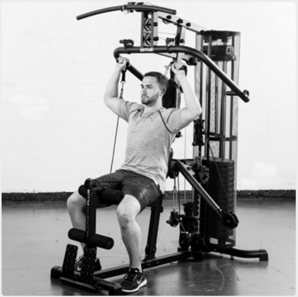
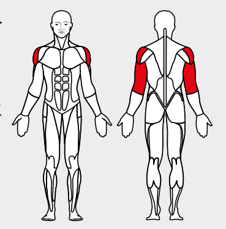

# 21. Shoulder press

__Starting position__: Set the 3D-FLEXMOTION arms to point downwards. Keeping the back straight, lean against the back rest.

__Movement__: Stretch the arms over the head and then lower them to an angle of 90° at the elbows.

__Muscles used__: Shoulder muscles, triceps

