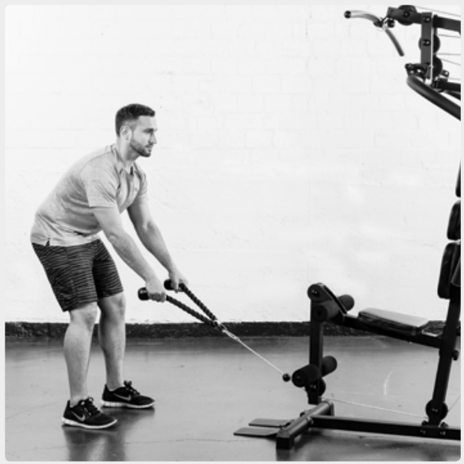
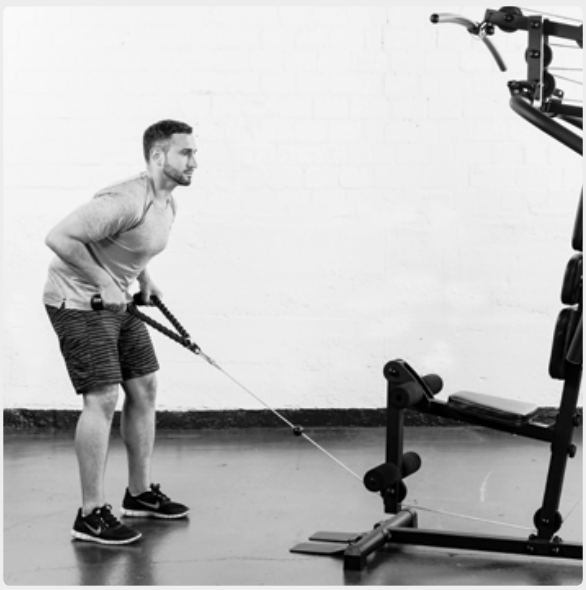
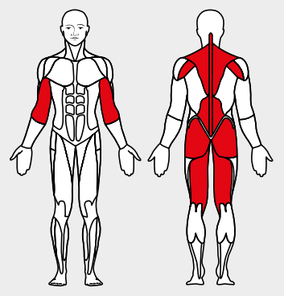

# 22. Bent-Over Row

__Starting position__: Fold the seat in. The upper body is bent forward almost parallel to the floor. Back straight with knees slightly flexed.

__Movement__: Arms extended, then pull from the shoulders and then pull the bar towards the body from the elbows.

__Muscles used__: Back-stretching muscles, rhomboid, shoulder muscles, biceps, seat, leg-bending muscles

