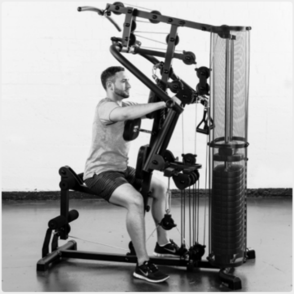
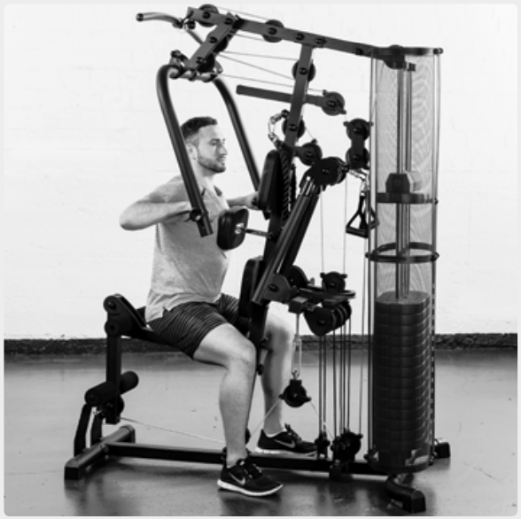
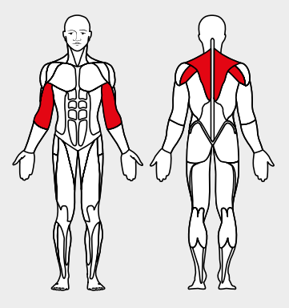

# 23. Lever Row

__Starting position__: Sit facing the machine keeping the back straight. Push the bar back into the rowing position.

__Movement__: First pull the shoulder blades together then pull the bar up to chest height.

__Muscles used__: Rhomboid muscle, rear shoulder muscles, biceps

