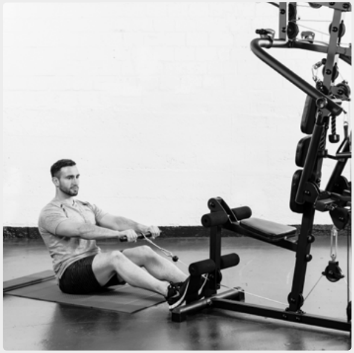
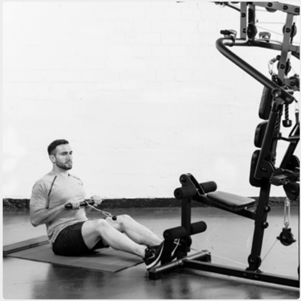
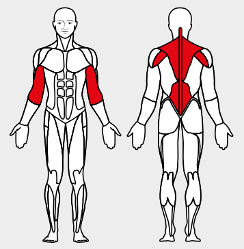

# 24. Cabel Row

__Starting position__: Sit on the floor facing the apparatus. Keep the back straight. Bend the legs slightly at the knees.

__Movement__: First pull from the shoulders keeping the arms extended, then pull the bar up to the chest.

__Muscles used__: Back-stretching muscles, rhomboid, rear should muscles, biceps

__Variant__: With bar, with loop, close, wide
