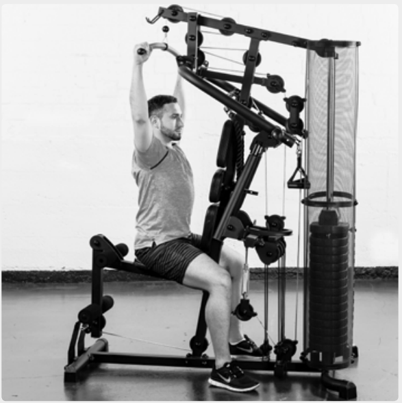
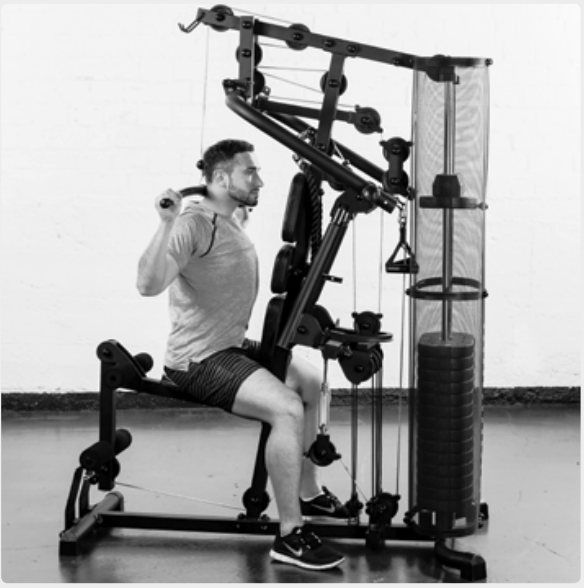
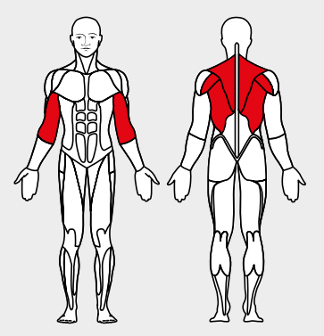

# 25. Latissimus Pulldown

__Starting position__: Seated upright. Attach the latissimus bar to the top pulley. The hands are well apart.

__Movement__: Keeping the arms extended, first pull the shoulder blades downwards. Then pull the bar down to the shoulders behind the head or down to the chest.

__Muscles used__: Latissimus, rear shoulder muscles, rhomboid muscle, biceps

__Variant__: Pull down to chest or down behind head
