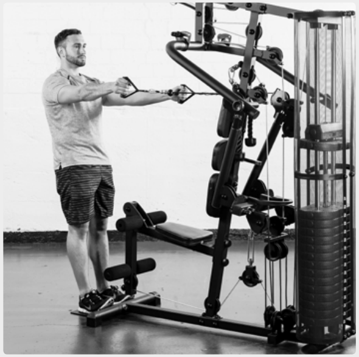
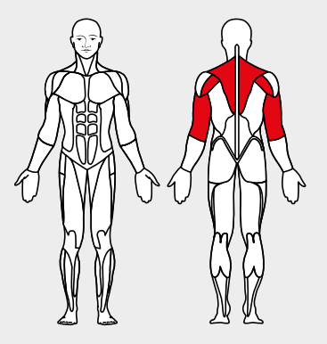

# 26. Reverse Flies

__Starting position__: Set the 3D-FLEXMOTION arms to point upwards. Fold the seat in. Stand facing the machine. Grasp the loops with the arms stretched.

__Movement__: Pull the shoulder blades together and move the stretched arms backwards at shoulder height.

__Muscles used__: Rhomboid muscles, rear shoulder muscles, triceps

