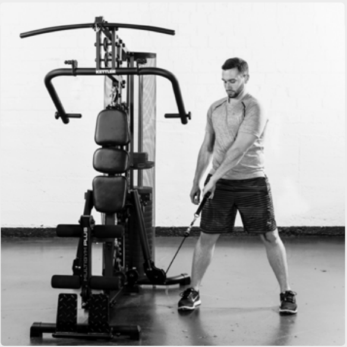
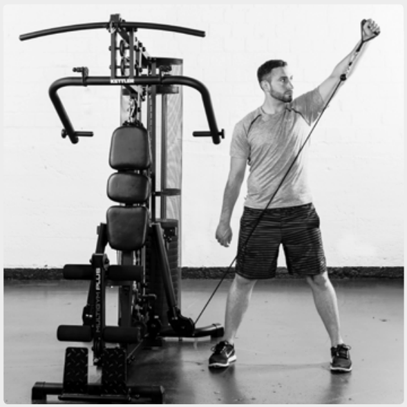
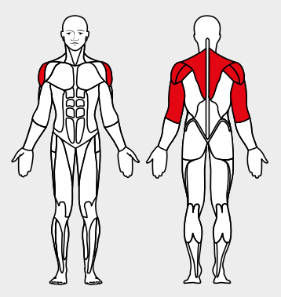

# 27. Crosswise pull

__Starting position__: Set the 3D-FLEXMOTION arms to point diagonally downwards. Fold the seat in and attach the rope extensions. Stand facing the machine. Cross the ropes and grasp the loops with the arms stretched.

__Movement__: Pull the shoulder blades together and pull the stretched arms diagonally upwards. 

__Muscles used__: Rhomboid muscle, rear and middle shoulder muscles, triceps

