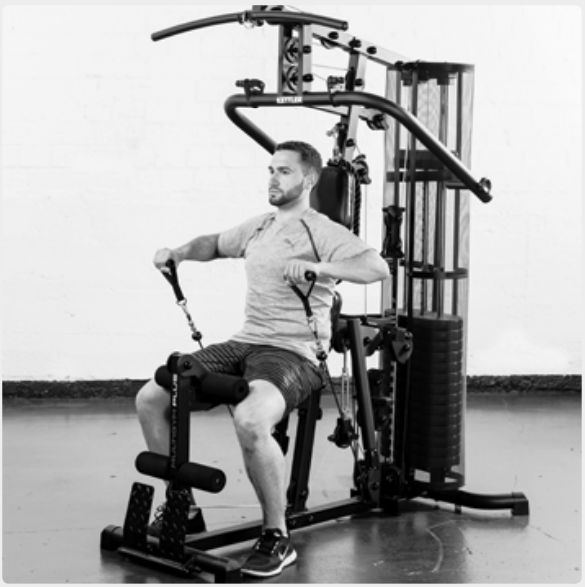
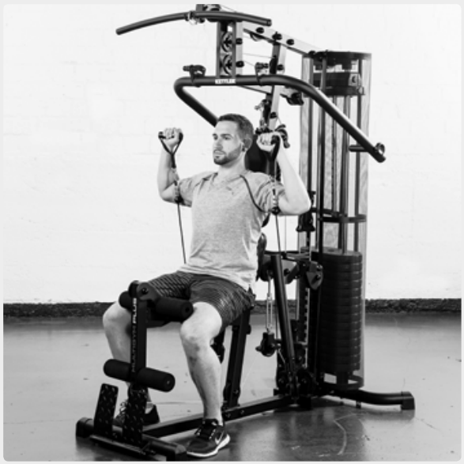
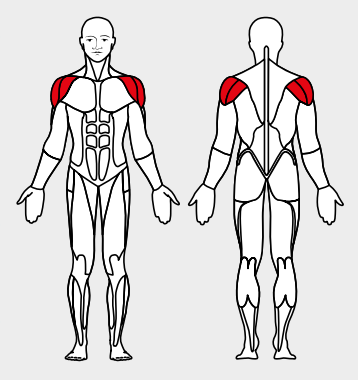

# 29. Outward shoulder rotation

__Starting position__: Set the 3D-FLEXMOTION arms to point downwards. Keeping the back straight, lean against the back rest. The upper arms are extended at shoulder level. The arms are bent at 90° at the elbows.

__Movement__: Turn outward at the shoulder joint.

__Muscles used__: Rotator cuff, outer rotator

