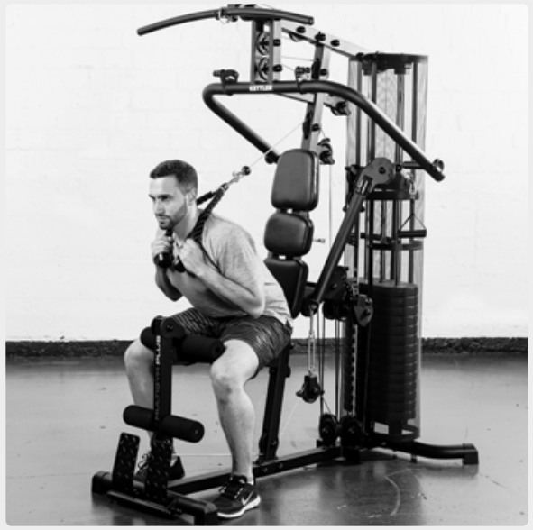

# 30. Cable Crunches

__Starting position__: Set the 3D-FLEXMOTION arms to point upwards. Keeping the back straight, lean against the back rest. Pull the loops over the shoulders.

__Movement__: Bend the torso forward.

__Muscles used__: Straight belly muscles.

__Variant__: In seated or reclined position or standing; on a gymnastics ball
