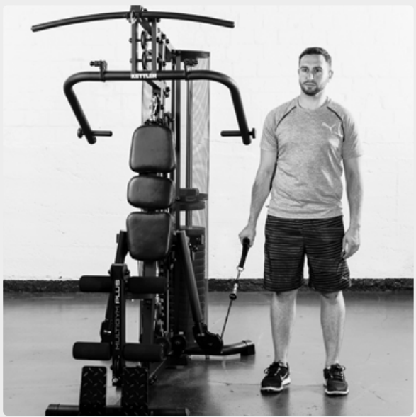
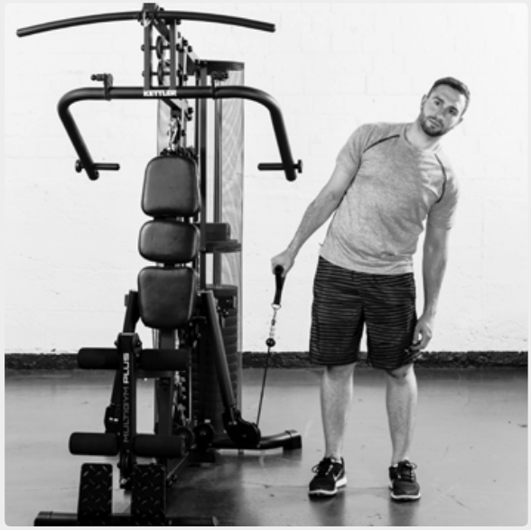
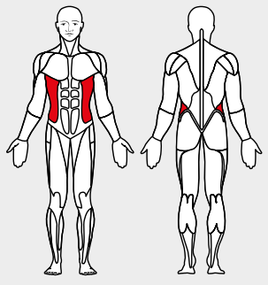

# 31. Side Bend

__Starting position__: Set the 3D-FLEXMOTION arms to point downwards. Stand with the machine at the side.

__Movement__: Keeping the upper body straight, bend it to the side away from the machine.

__Muscles used__: Lateral belly muscles

